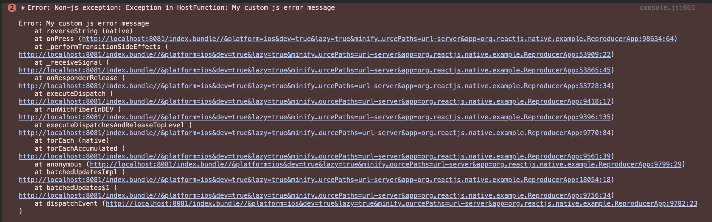

## Different JavaScript Runtime Errors when using iOS Prebuilds

This repository is a minimal reproducer for a bug in react-native 0.81.0 where the app throws different JavaScript runtime errors (thrown from JSI) when using iOS prebuilds.

<table>
  <tr>
    <th>Building from source</th>
    <th>iOS Prebuild</th>
  </tr>
  <tr>
    <td>My custom js error message</td>
    <td>Non-js exception: Exception in HostFunction: My custom js error message</td>
  </tr>
  <tr>
    <td>
    
</td>
    <td>
</td>
  </tr>
</table>

This repository is based on the [reproducer-react-native template](https://github.com/react-native-community/reproducer-react-native) + the [Pure C++ Turbo Native Module example](https://reactnative.dev/docs/the-new-architecture/pure-cxx-modules).

You can reproduce the issue by following these steps:

1. Run `pod install`

2. Build and run the app on iOS

3. Press "Reverse" and observe the standard error message in the Redbox.

4. Reinstall pods using prebuilds `RCT_USE_RN_DEP=1 RCT_USE_PREBUILT_RNCORE=1 pod install`

5. Build and run the app on iOS again

6. Press "Reverse" and observe the different error message in the Redbox.

Observe that the error message is different on the DevTools Console as well

